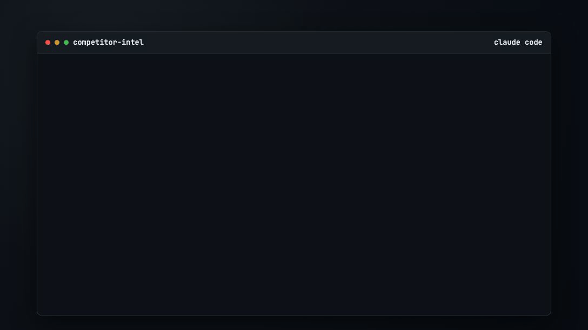

# Competitor Intel Agent

Receive weekly competitor briefings on market changes, threat shifts, and positioning opportunities.

No coding experience required.

## Live demo



## Quick start

**Prerequisite:** Claude Code installed and authenticated. [Setup instructions](https://code.claude.com/docs/en/quickstart).

1. Paste this command into **Terminal** (Mac) or **PowerShell** (Windows):

```bash
git clone https://github.com/ryan-hennebry/competitor-intel.git && cd competitor-intel && claude --dangerously-skip-permissions
```

2. In Claude chat, complete onboarding with the agent. It will walk you through setup one question at a time.

## The onboarding flow

- Provide your company URL (or a description)
- The agent suggests competitors (you can add/remove)
- Set priorities (keep defaults or customize)
- Pick delivery: files only, email, Slack, or both

## Visual proof

- `assets/readme-cli-proof.png` (placeholder): one cropped CLI screenshot showing onboarding + completed run
- `assets/readme-briefing-preview.png` (placeholder): one real briefing screenshot showing threat landscape + recommendations

## What you receive

A weekly briefing with:

- Quick take
- Recommendations (Act Now / Watch / Opportunity)
- What changed
- Threat landscape
- Open questions

## Once your report has been generated

Continue to interact with the agent for deeper analysis:
- "Which competitor changed positioning most in the last 30 days?"
- "Compare [Competitor A] vs [Competitor B] on ICP overlap."
- "What are the top 3 risks to our narrative this quarter?"
- "Show only changes that should alter pricing or packaging."
- "What assumptions in the latest briefing are low confidence?"

## Delivery options

- **Files only** (default): saves outputs to `output/briefings/`
- **Email via Resend:** requires a `RESEND_API_KEY`. Create one on [Resend](https://resend.com/docs/dashboard/api-keys/introduction), then paste it into the chat
- **Slack:** requires a `SLACK_TOKEN`. Create a Slack app on [Slack](https://api.slack.com/apps), copy the Bot User OAuth Token (`xoxb-...`), then paste it into the chat
- **Email + Slack:** requires both credentials

## How it works

<picture>
  <source media="(prefers-color-scheme: dark)" srcset="assets/how-it-works-dark.svg">
  
</picture>

*Diagram source: `assets/how-it-works.mmd`.*

## The agent's output

- `context.md` -> company context, competitors, priorities, delivery, and run history
- `output/briefings/` -> generated briefings
- `output/snapshots/` -> per-competitor snapshots for change tracking
- `output/last_run.json` -> latest agent run data and status (`success`, `error`, `skipped`)

## Project standards

- [MIT License](LICENSE)
- [Security Policy](SECURITY.md)
- [Contributing Guide](CONTRIBUTING.md)
