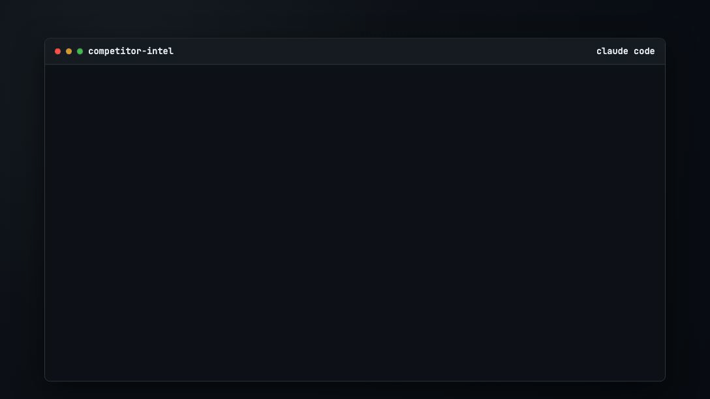

# Competitor Intel

Track competitor moves and surface threats and opportunities.

Each run compares your company and competitors with the last one, then turns the important changes into a briefing with recommended actions.

No coding experience required.



## Quick start

1. [Install Claude Code](https://code.claude.com/docs/en/quickstart).
2. Paste this into **Terminal** (Mac) or **PowerShell** (Windows):

```bash
git clone https://github.com/ryan-hennebry/competitor-intel.git && cd competitor-intel && claude --permission-mode auto
```

Follow the onboarding. It researches your company, suggests competitors, and asks you to confirm what matters.

## Briefing

- The most important shift
- Recommendations: **Act Now**, **Watch**, or **Opportunity**
- What changed across competitors and your company
- Why each move matters
- What to track next

## Ask follow-up questions

- "Which competitor changed positioning most in the last 30 days?"
- "What are the top 3 risks to our narrative this quarter?"
- "Show only changes that should alter pricing or packaging."

## Delivery

Run it on demand or on a schedule. Briefings save to `output/briefings/` and can also be sent by email or Slack.

## How it works

<picture>
  <source media="(prefers-color-scheme: dark)" srcset="assets/how-it-works-dark.svg">
  
</picture>
